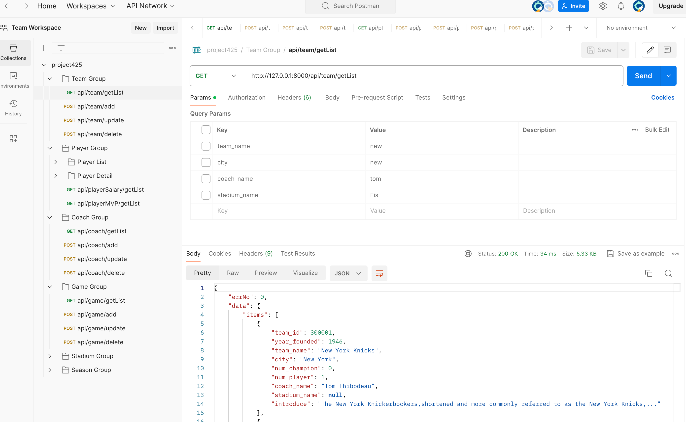
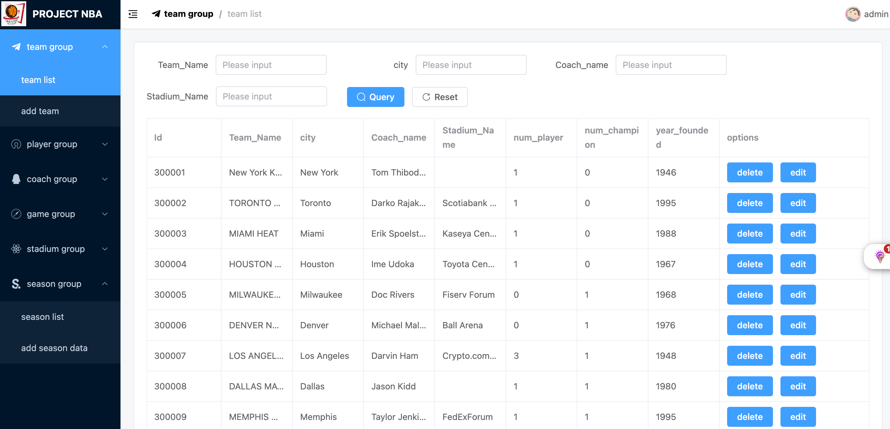
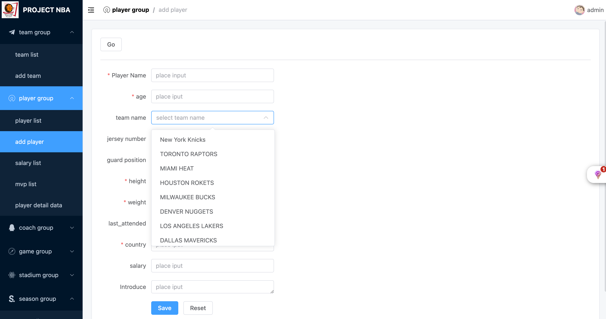

#### 1.requirements lists

##### team group

- list
- curd

##### player group

- list
- curd
- salary list
- mvp list
- detail list
  - curd

##### coach group

- list
- curd

##### game group

- list
- curd

##### stadium group

- list
- curd

##### season group

- list
- curd

#### 2.DDL and DML

- view file:db.sql

#### 3.project code

- Project architecture: Server uses python+django, database uses mysql8.3, front-end uses vue3+vite+axios
- code address:[visit](https://gitee.com/webdzq/dbproject)
- use DBeaver manage mysql

##### db connect

```python
DATABASES = {
    'default':{
        'ENGINE':'django.db.backends.mysql',
        'NAME':'project425',
        'USER':'root',
        'PASSWORD':'12345678',
        'HOST':'127.0.0.1',
        'PORT':'3306'
    }
}

```

##### dependencies modoles and install

- version:python3.7 or python3.9
- version:django3.2.5

```python
# backend
# install 
pip install django=3.2.5,pymysql,rest_framework,drf_yasg
# db synchronous
python manage.py makemigrations restfulapi
python manage.py migrate restfulapi
# frontend
view file: package.json
# install
download:nodejs env
# mac
sudo npm install yarn -g
yarn 

```

##### start cmd

```python
# frontend and backend build
./bulid.sh
visit address： http://127.0.0.1:8000/


# only frontend
cd backend
yarn dev 
visit address： http://localhost:4000/

# only backend 
cd backend
python manage.py runserver
visit address： http://127.0.0.1:8000/

```

#### 4.postman test server interface

- Invite people to this workspace :[invite](https://app.getpostman.com/join-team?invite_code=50b47d9ecc6331c3a3fc09747f5906f6&target_code=2adb067cc38611979f0b13d0c641545c)
- The service needs to be started locally because of the interface address ：http://127.0.0.1:8000/api/xx
- Video demo, see file for details:xxxxxxxxx



#### 5.Project structure tree

```
dbproject
├─.gitignore
├─build.sh  # build script
├─readme.md
├─frontend # userview block
|    ├─package.json
|    ├─vite.config.ts
|    ├─yarn.lock
|    ├─src
|    |  ├─App.vue
|    |  ├─main.ts
|    |  ├─views
|    |  |   ├─team
|    |  |   |  ├─add.vue
|    |  |   |  └index.vue
|    |  |   ├─stadium
|    |  |   |    ├─add.vue
|    |  |   |    └index.vue
|    |  |   ├─season
|    |  |   |   ├─add.vue
|    |  |   |   └index.vue
|    |  |   ├─player
|    |  |   |   ├─add.vue
|    |  |   |   ├─detail.vue
|    |  |   |   ├─edit.vue
|    |  |   |   ├─index.vue
|    |  |   |   ├─mvp.vue
|    |  |   |   └salary.vue
|    |  |   ├─game
|    |  |   |  ├─add.vue
|    |  |   |  └index.vue
|    |  |   ├─coach
|    |  |   |   ├─add.vue
|    |  |   |   └index.vue
|    |  |   ├─Error
|    |  |   |   ├─403.vue
|    |  |   |   ├─404.vue
|    |  |   |   └500.vue
|    |  ├─router
|    |  |   └index.ts
|    |  ├─layout
|    |  |   ├─Layout.vue
|    |  |   ├─components
|    |  |   |     ├─AppView.vue
|    |  |   |     ├─ToolHeader.vue
|    |  |   |     └useRenderLayout.tsx
|    |  |   ├─axios
|    |  |   |   ├─config.ts
|    |  |   |   ├─index.ts
|    |  |   |   ├─service.ts
|    |  |   |   ├─types
|    |  |   |   |   └index.ts
|    |  ├─api
|    |  |  ├─TeamGroup
|    |  |  |     ├─index.ts
|    |  |  |     └types.ts
|    |  |  ├─StadiumGroup
|    |  |  |      ├─index.ts
|    |  |  |      └types.ts
|    |  |  ├─SeasonGroup
|    |  |  |      ├─index.ts
|    |  |  |      └types.ts
|    |  |  ├─PlayerGroup
|    |  |  |      ├─index.ts
|    |  |  |      └types.ts
|    |  |  ├─GameGroup
|    |  |  |     ├─index.ts
|    |  |  |     └types.ts
|    |  |  ├─CoachGroup
|    |  |  |     ├─index.ts
|    |  |  |     └types.ts
├─backend   # server block
|    ├─manage.py
|    ├─restfulapi  # server interface
|    |     ├─__init__.py
|    |     ├─admin.py
|    |     ├─apps.py
|    |     ├─models.py
|    |     ├─serializers.py
|    |     ├─tests.py
|    |     ├─urls.py
|    |     ├─views.py
|    ├─dist  # userview build result
|    |  ├─.DS_Store
|    |  ├─favicon.ico
|    |  ├─index.html
|    |  ├─logo.png
|    |  ├─static
|    ├─backend 
|    |    ├─__init__.py
|    |    ├─asgi.py
|    |    ├─settings.py # db setting
|    |    ├─urls.py
|    |    ├─wsgi.py
```

#### others

- Front-end code format correction

```
yarn lint:eslint
```

- prject#5 progress- 90% ,The remaining details need to be adjusted
- prject#5 preview

  

  
